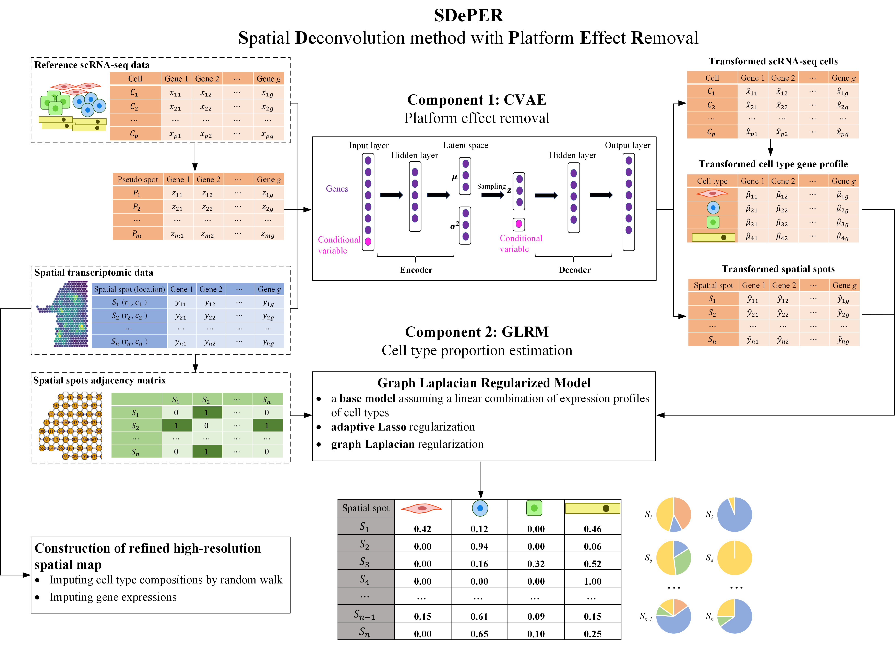

     

CVAE-GLRM is a two-step **hybrid** machine learning and regression method considering platform effect, spatial information and sparsity in **deconvolution** of spatial transcriptomic data using reference single-cell RNA sequencing data from same tissue type. CVAE-GLRM further supports **imputing cell type compositions and gene expression at enhanced resolution** by constructing random walk on the estimated cell type compositions.

**Full documentation** for CVAE-GLRM is available on [Read the Docs](https://cvae-glrm.readthedocs.io/en/latest/).

For Notebooks and results of running CVAE-GLRM on both Simulated and Real datasets, and Notebooks of Figure Panels in manuscript please refer GitHub repository [CVAE-GLRM_Analysis](https://github.com/az7jh2/CVAE-GLRM_Analysis).
